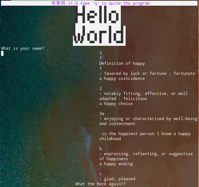
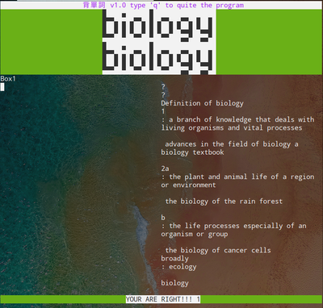
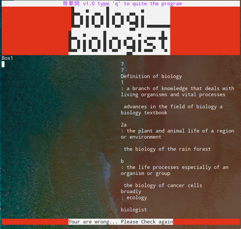

# urwid_Vocabulary
python写的背单词软件(基于urwid), 英英释义(韦伯词典), 日常记录, 统计绘图用的R语言

This is  a script write by Python and is based on urwid lib.

It can check your spelling and give the explanation from the https://www.merriam-webster.com/ (local database:Needlman/DB_Word_Explain.WB)

I'll add more features like other Dictionary, Synomies or sort of thing in the near future and the processing is dependent on... random.

### Before running the script, <b>deleted the Needlman/En.log first</b>. (Because This is mine record)

prepare your environment:
```
pip install urwid numpy
```

run  
```python3 main.py```

<p align='center'>

</p>

If your Spelling is RIGHT:
<p align='center'>

</p>

If your Spelling is WRONG
<p align='center'>

</p>

## how to hack this script:

<i>main.py</i> is for the <u>layout</u> and some basic functions like reading your type. So, to deal with it, you'd better have some basic knowledge about <u>urwid</u>.

After you typed the word in the edit box and typed enter, the script <i>Needlman/Needle_Spll.py</i> will check your input with the word from <i>Needlman/Word</i> and record the result into <i>Needlman/En.log</i>. At the same time, the explanation will be extracted from <i>Needlman/DB_Word_Explain.WB</i>.

As a result, you can design your personal program by rewrite the Needlman/Word Needlman/DB_Word_Explain.WB

For visualizing the record, please make sure that R is installed.
run:
```
cd Needlman
Rscript Log_graph2.R
```
<p align='center'>

</p>
